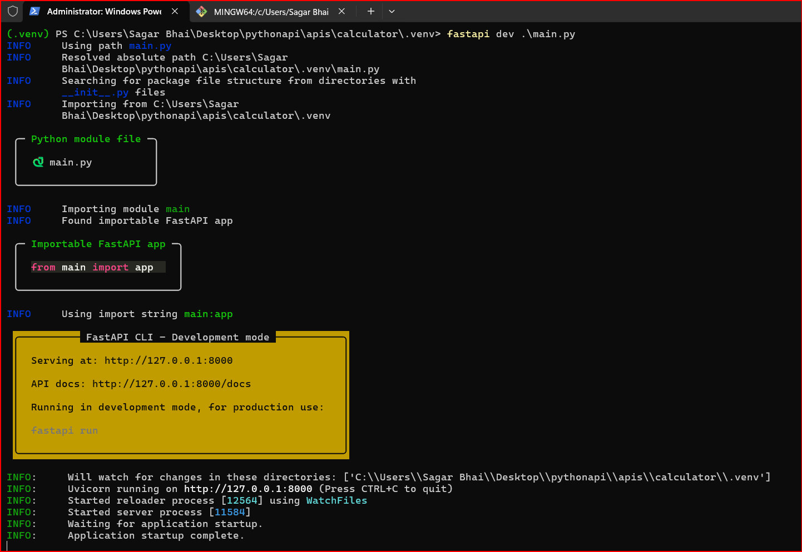
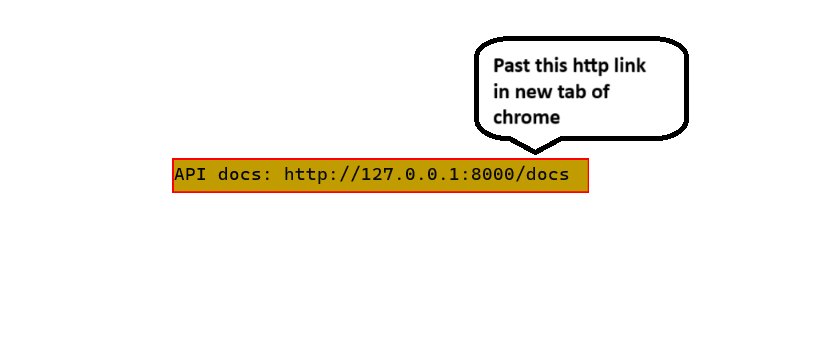
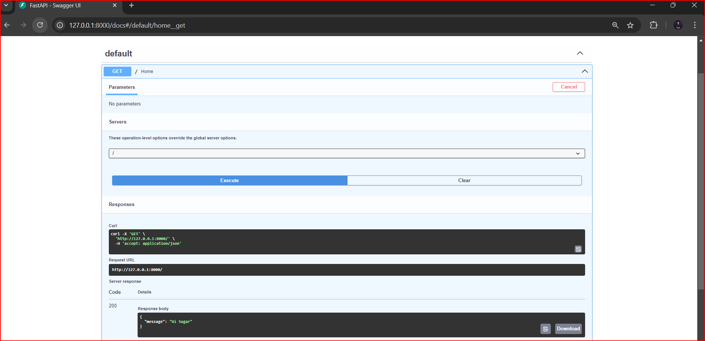
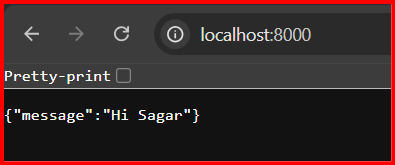

# Calculator_Demo
I have created a Calculator using FastAPI and Python.

### First fast api Application --- Calculator

1) First Create a git ignore file 
 . create a direcotry using 'mkdir' then create a git ignore file 
 . open a file using 'Vi file_name' and past git ignore code in that file 
    you can refer this link - https://www.toptal.com/developers/gitignore/api/python,visualstudiocode,pycharm+all
 . create  a direcotry name as calculator & create new environment using command ' python -m venv .venv ' 
    inside the calculator direcotry.
 . After that activate the virtual environment using this command ' .\.venv\Scripts\activate ' In new window shell activate the 
  
  2)  install fast api in shell ' pip install fastapi[standard] ' offical website : https://fastapi.tiangolo.com/#requirements
       
	   . What is Fastapi?
	ANS : FastAPI is a powerful and fast Python web framework well-suited for building APIs, with features that make development 
	       efficient and the resulting APIs robust and easy to use. Its performance, ease-of-use, and modern design have made it a popular choice for Python API development in recent years.

 3) Install Uvicorn using ' pip install uvicorn ' 
 
    . What is Uvicorn ?
	ANS : Uvicorn is a powerful ASGI server that enables the development of fast, asynchronous web applications in Python, making it a popular choice among developers for building APIs and 
	      real-time applications.
		   
 4) use this command after that ' pip freeze > requirements.txt ' 
       
	    . What is the use of  " pip freeze > requirements.txt "
		ANS : Is used in Python development to create a requirements.txt file that lists all the installed packages in the current environment along with their specific versions. 
		      This file is essential for managing dependencies in Python projects. A vital command for Python developers to maintain and share project dependencies effectively,
			  facilitating smoother collaboration and deployment processes.

5)  open visualstudiocode and select python interpreter location example " Python 3.12.6('.venv':venv).\.venv\Scripts\python.exe "

6)  Create a file inside the calculator example main.py .

7) past a code of main.py hear '  ' 

8)  then use this command in shell to see  FastAPI ' fastapi dev main.py' 

### Final Output

.......................................******************************........................................
